# Force-Augmented EKF for LFP Battery State Estimation

A simulation study of SOC estimation on a pack of LFP cells. It compares a **fair, resistance-estimating baseline** voltage + coulomb-counting EKF against a 3-state EKF that additionally folds in per-cell force measurements and opportunistic ICA (dQ/dV) anchoring. The two extra ideas come from Fly & Chen (2020) and Jia et al. (2024); this puts them together and stress-tests the result.

**SOH is intentionally out of scope.** Cells still differ in true capacity/health in the ground-truth simulation (that's what makes the "dodgy supplier" pack realistic), but neither filter estimates or reports SOH. A real BMS would use a dedicated method for that (capacity test, aging-trend analysis, etc.). Both filters here coulomb-count against the same nameplate capacity, so any gap between them comes purely from the voltage/force/ICA measurement channels.

## The scenario

A community BESS operator buys 20 prismatic LFP cells (280 Ah nominal) from a supplier they don't fully trust. No calibration sheet comes with them. The pack gets installed and put straight into duty. The BMS has to work out — from a cold start, while the pack is already cycling — the SOC of every cell.

Target: pack SOC within 5% in 20 minutes. Bonus: per-cell SOC.

This is deliberately a worst case. A real pack usually starts from a known full charge, so the estimator gets a warm start. Making it work from total ignorance is the hard version of the problem.

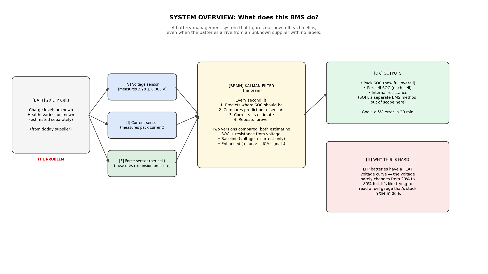

## Why LFP makes this hard

LFP has a nearly flat open-circuit voltage across most of its useful range. Pulling a C/200 quasi-equilibrium discharge out of PyBaMM's `Prada2013` parameter set gives about **57 mV of total variation across SOC 15–85%**, and roughly 61% of that band sits below |dOCV/dz| < 0.06 V per unit SOC.

So a voltage-based Kalman filter has almost nothing to work with in the middle of the range, *for SOC specifically*. It turns out this matters less than expected once the filter is also allowed to estimate resistance — see "Two filters" and the results below.

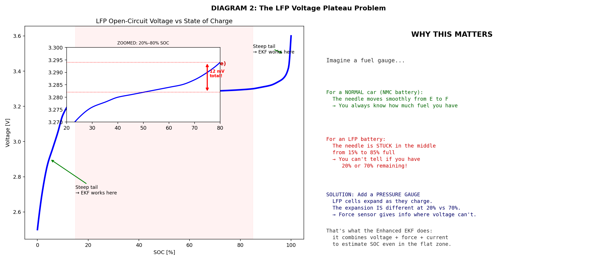

## Two filters, side by side

**Baseline EKF.** Two states, `x = [z, R₀]`. Coulomb counting for the SOC prediction, resistance held near-constant for its own prediction, both corrected jointly from the voltage update. This is the fair version of "classical" — it removes the confound of one filter knowing its own resistance and the other not.

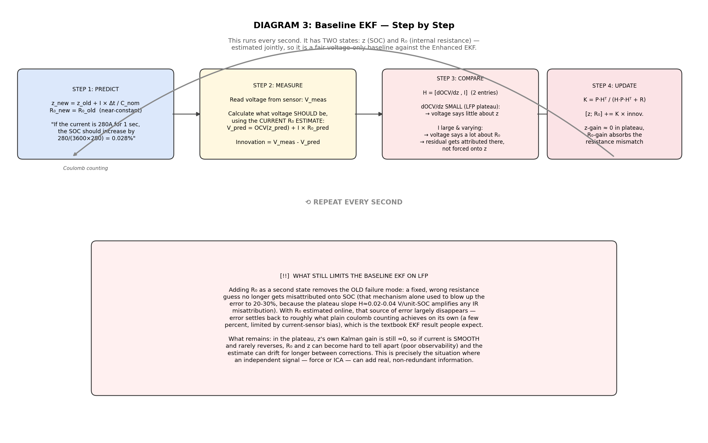

**Enhanced 3-state EKF.** State vector `x = [z, R₀, f_bias]`. Same voltage update as the baseline, plus two more measurement channels:

- **Force.** LFP cells swell as they charge. Each cell has a small load cell reading the pressure. The force–SOC curve is non-monotonic (inflections near 30% and 70%), so an inflection gate scales the measurement noise `R_F` inversely with `|dF/dz|` — this stops the filter from being dragged the wrong way near a turning point (Jia et al., §II).
- **ICA anchor.** During a slow C/6 window in commissioning, dQ/dV is computed with IR compensation (Fly & Chen, §3.2). When a graphite-staging peak passes, SOC snaps to a known value. Fly & Chen show ICA is only usable at ≤ C/6 — at 1C only one peak survives and it smears into the plateau.

The two channels are balanced by the tanh covariance update from Jia et al. (Eq. 13–14): the voltage measurement noise `R_U` and the force process noise `Q_F` are adjusted every step by `tanh(μ·e²_U)`, with `e_U` the smoothed voltage residual. When voltage tracks well, trust voltage. When it doesn't, lean on force.

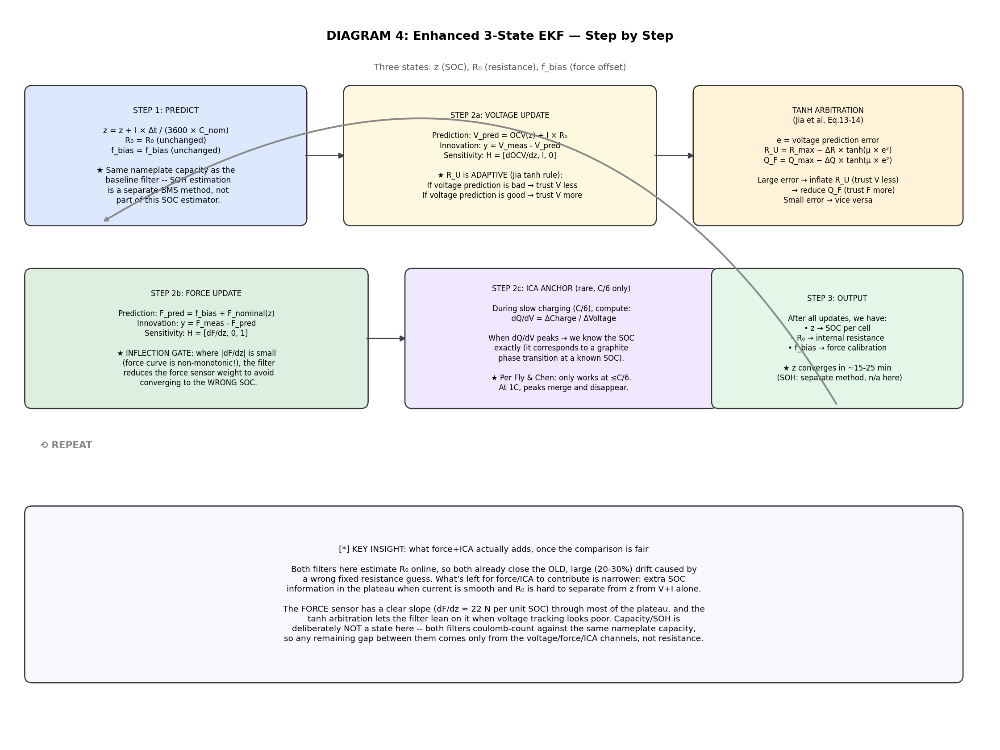

## The headline finding: it depends on the duty cycle

Once the comparison is fair, force+ICA fusion is **not a universal win**. Across 20 Monte Carlo draws per scenario:

| Scenario | Pack RMSE — Baseline | Pack RMSE — Enhanced | Who wins |
|:---|:---|:---|:---|
| Peak Shaving | **5.1%** [4.4, 6.2] | 6.1% [5.2, 7.2] | Baseline, 20/20 draws |
| PV Self-Consumption | 9.8% [7.9, 11.8] | **5.9%** [4.6, 7.6] | Enhanced, 20/20 draws |
| FCR | **3.2%** [2.6, 5.0] | 4.7% [3.1, 6.7] | Baseline, 18/20 draws |

**Why:** a 2-state filter can only separate SOC from resistance if current varies enough over time. Peak Shaving and FCR both drive current through sharp steps and frequent reversals, which is exactly what a 2-state filter needs to nail resistance on its own — so the baseline does great, and the extra force/ICA channels mostly add noise instead of information. PV self-consumption ramps current up and down as one smooth, continuous curve tracking a solar profile — no sharp reversals — which starves the baseline of the excitation it needs, and that's precisely where an independent, current-independent signal like force earns its keep.

Full numbers, plots, and the observability argument in more depth are in `REPORT.md` §7.

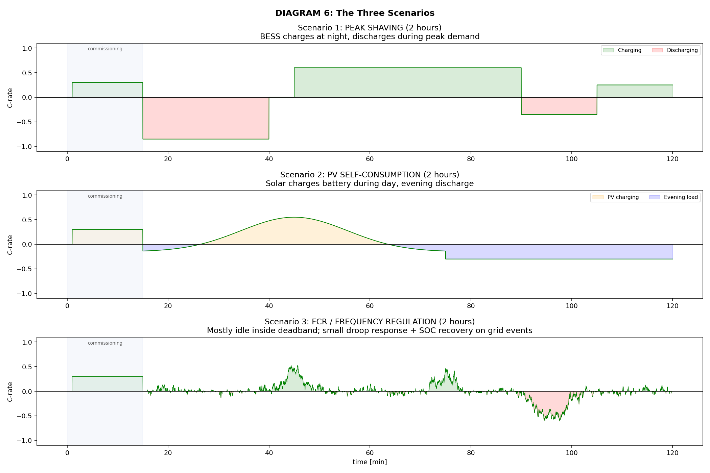

- **Peak Shaving** — evening discharge, off-peak recharge, morning top-up. Deep, discrete SOC swings.
- **PV Self-Consumption** — bell-shaped generation with cloud transients, evening discharge. Smooth, continuous current.
- **FCR** — grid frequency regulation, closed-loop: a synthetic grid-frequency signal (Ornstein-Uhlenbeck wander plus a few disturbance events) drives a deadband + droop response, and a SOC-recovery controller nudges the pack back toward 50% when it drifts past a band. Mostly idle, with frequent small sign reversals when active.

## Ground truth: what the filter never sees

Easy way to fool yourself in a simulation study: let the filter and the "truth" secretly share the same model, so of course it looks great. To avoid that, the ground-truth pack carries a bunch of mismatches the filter is never told about:

- Per-cell true capacity spread over SOH 0.80–1.00 — this is where the "dodgy supplier" cell-to-cell spread actually lives. It changes each cell's true OCV/SOC trajectory; the filter never sees the SOH number itself.
- Per-cell OCV curves with small V-axis offsets and slope tilts.
- Per-cell force curves with independently perturbed linear and sinusoidal amplitudes plus a phase shift.
- A 1RC diffusion term on the true voltage that neither filter models.
- A persistent current-sensor gain error (±0.6%) and offset (±0.5 A) — the real reason coulomb counting drifts, not per-sample noise.
- Two of the 20 cells run on PyBaMM's SPMe model with `Prada2013` parameters, giving a physics-based reference next to the empirical model used for the other 18.

Sensor noise is Gaussian: 3 mV voltage, 3 N force, 0.5 A current.

## Correctness check first

Before the hard problem, `ekf_validation.py` runs both filters with initial SOC known to ±5%. This separates real bugs from physics limits.

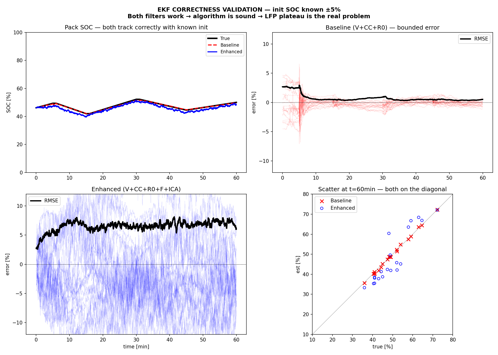

Latest run: **baseline MAE ≈ 0.4% at end, enhanced MAE ≈ 5.2% at end.** Both filters converge correctly, but with SOC already roughly known and current providing good excitation, the fair baseline needs nothing else and nails it; the enhanced filter's extra force/ICA channels add their own convergence transients and sensor noise with no compensating benefit in this easy regime, so it actually does worse here. That's not a bug — it's the same duty-cycle-dependence story as the main results, from the opposite direction: force fusion helps when resistance is hard to pin down, and gets in its own way when it isn't.

## Results — Peak Shaving, PV, FCR (Monte Carlo, 20 packs per scenario)

| Scenario | Pack RMSE — Baseline | Pack RMSE — Enhanced | Cell MAE @ end — Baseline | Cell MAE @ end — Enhanced |
|:---|:---|:---|:---|:---|
| Peak Shaving | 5.1% | 6.1% | 7.4% | 6.7% |
| PV Self-Consumption | 9.8% | **5.9%** | 11.5% | **6.4%** |
| FCR | 3.2% | 4.7% | 7.5% | 7.8% |

(Medians across 20 randomly drawn packs per scenario; see `REPORT.md` for percentile bands.)

### Peak Shaving

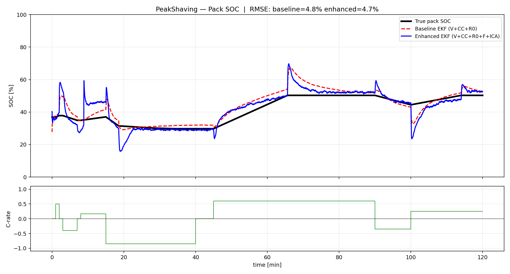
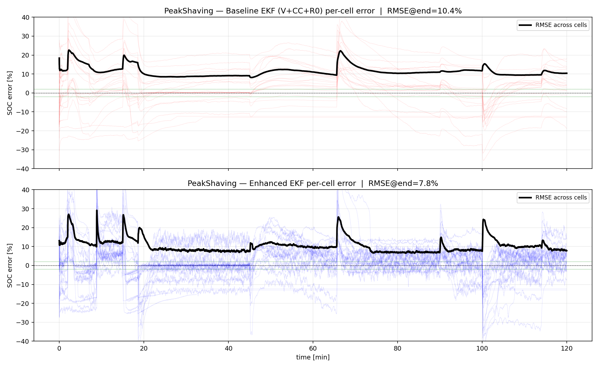

### PV Self-Consumption

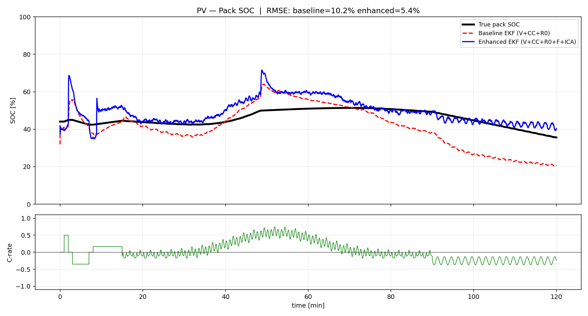
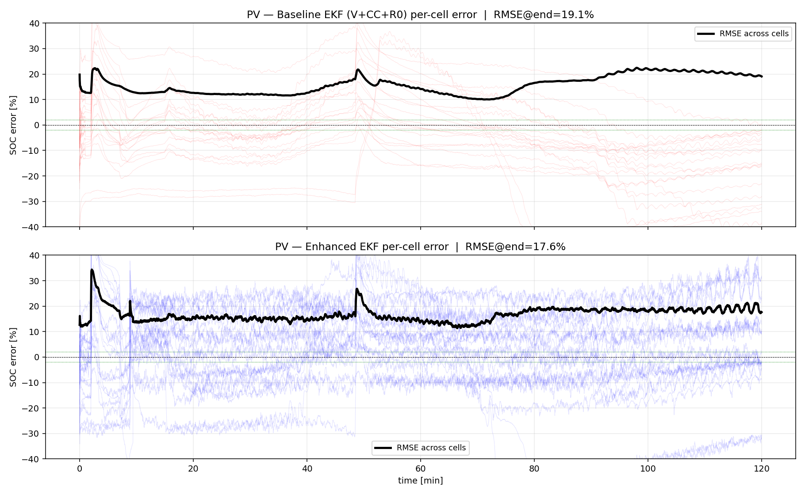

### FCR

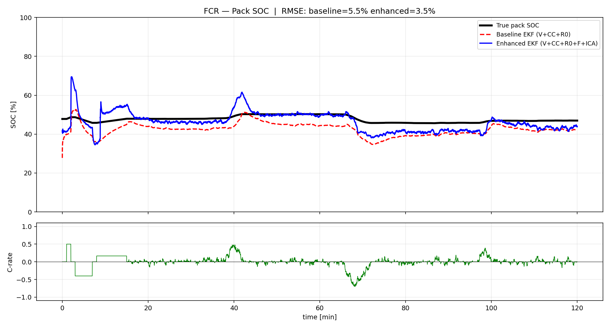
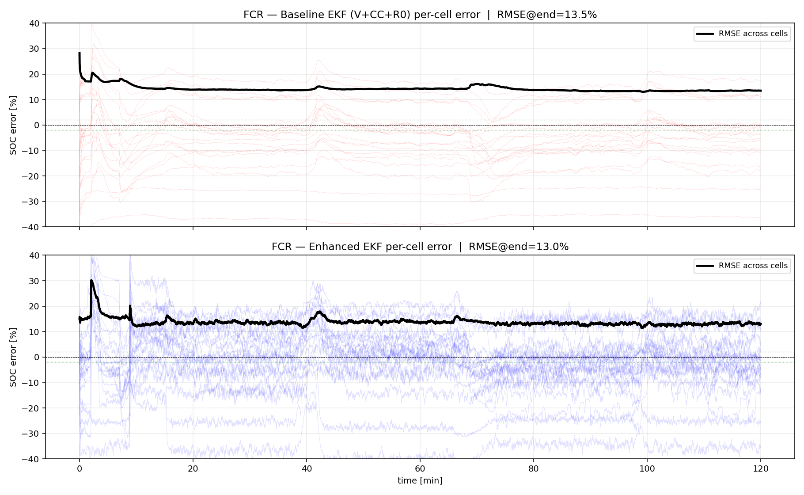

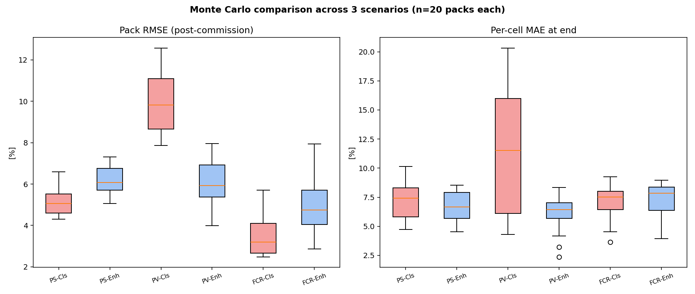

Each scenario folder also has `_3_scatter.png` (true vs. estimated SOC at 15 min and at the end), `_4_force.png` (raw per-cell force signal), and `_5_error_vs_soc.png` (final error plotted against true SOC, with the OCV plateau shaded) from the single-draw PyBaMM cross-check run.

## Results — pseudo-random SOC-distribution scenarios (error + RMSE only)

Two additional initial-SOC distributions were layered onto all three duty cycles (6 single-draw runs total, empirical cell model, error+RMSE plot only):

- **Scenario A — `cluster20_35`**: 13 of 20 cells start with SOC in [20%, 35%], the remaining 7 uniform-random.
- **Scenario B — `cluster10_15_25_35`**: 5 cells in [10%, 15%], 5 cells in [25%, 35%], remaining 10 uniform-random.

| Run | Pack RMSE — Baseline | Pack RMSE — Enhanced |
|:---|:---|:---|
| PeakShaving × A | **6.0%** | 7.0% |
| PV × A | **7.0%** | 8.4% |
| FCR × A | **2.5%** | 3.3% |
| PeakShaving × B | **4.9%** | 5.8% |
| PV × B | **8.9%** | 10.3% |
| FCR × B | **1.9%** | 3.2% |

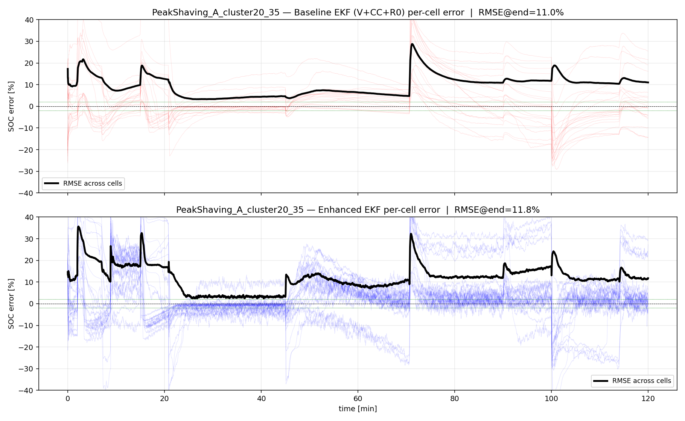
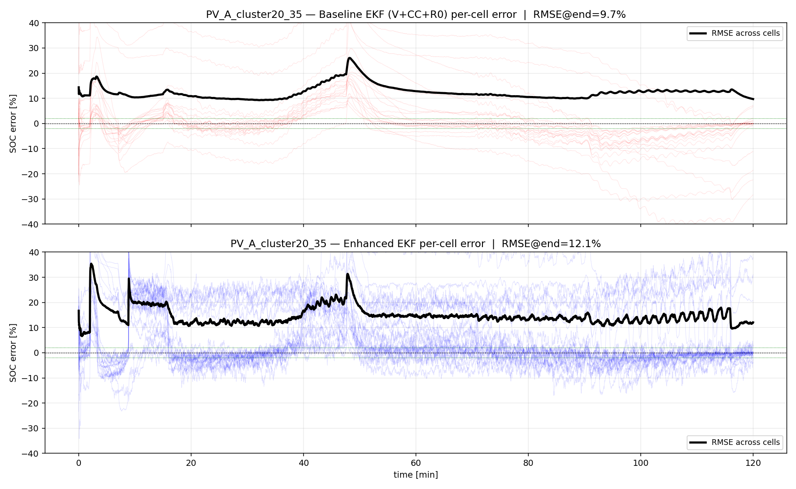
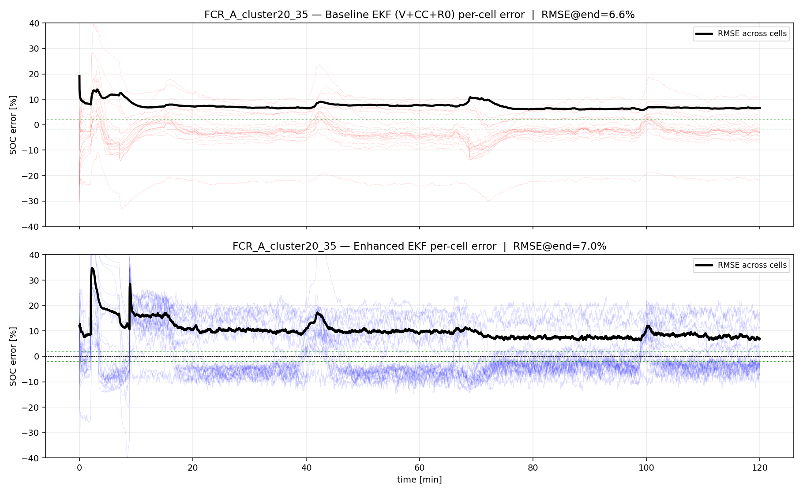
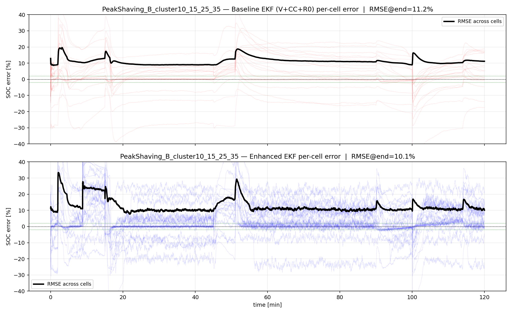
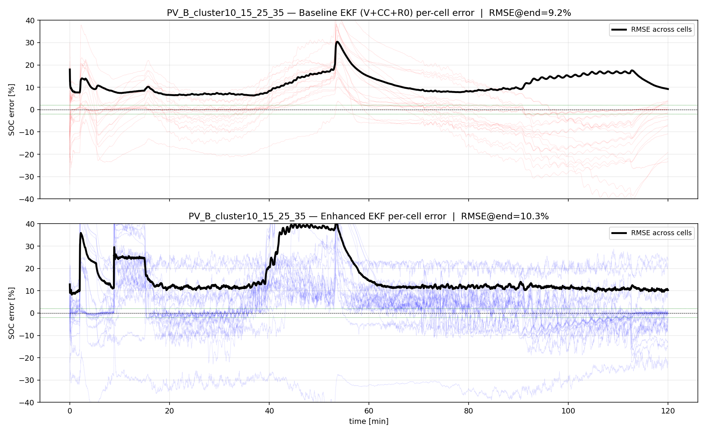
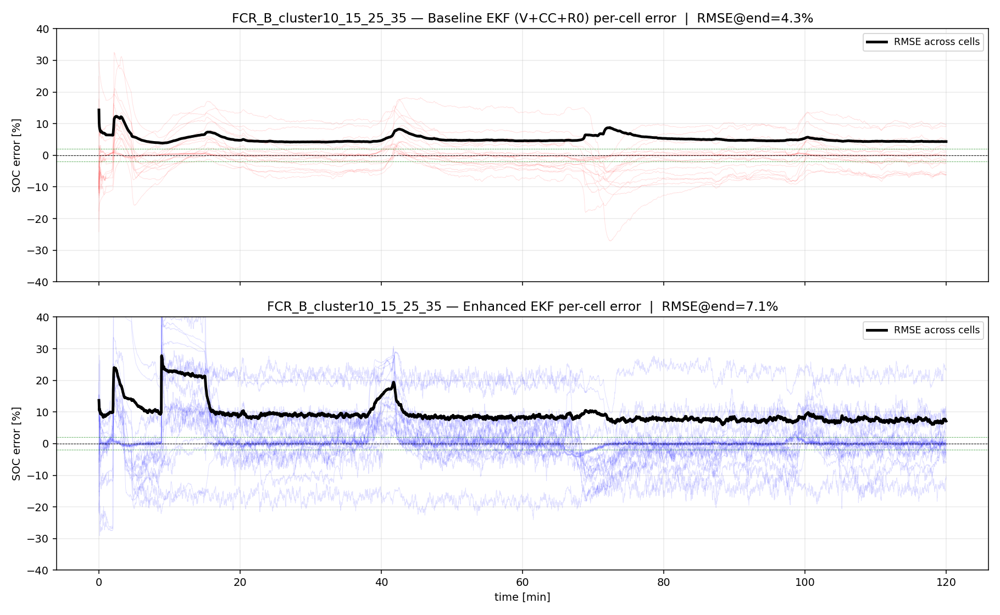

**Worth flagging honestly:** the baseline wins all six of these single-draw runs, including both PV rows — which contradicts the 20-draw PV Monte Carlo result above (enhanced ahead 20/20). Two single draws are too small a sample to override a 20-draw result; this is most likely ordinary single-draw variance, though it's also possible clustered initial SOC changes the effective excitation enough to matter — that would need its own Monte Carlo sweep to check, not done for this report. Treat the 20-draw PV result as the one to trust, with this as an open question, not a contradiction that's been resolved.

## Why the fair comparison mattered

The original version of this study compared a 1-state baseline (fixed, wrong resistance) against the 3-state enhanced filter, and the baseline's error floor sat at 20-30% under known-SOC validation — high enough that "3-5% is what a normal EKF gets" was a completely reasonable objection to raise. Tracing it down: a 1-state filter with no resistance state has nowhere to put a resistance-mismatch-driven voltage error except onto the SOC estimate, and because the LFP plateau slope is so shallow, that misattribution gets amplified into a large apparent SOC error. Giving the baseline its own resistance state (this revision) closes that failure mode almost entirely — known-SOC baseline error dropped to under 1%. What's left, once that confound is removed, is the real and much narrower question this report now answers: does force+ICA fusion help on top of a resistance-aware baseline, and the answer is yes, substantially, specifically when the duty cycle doesn't provide enough current excitation to separate resistance from SOC on its own.

## A follow-up ablation: does coulomb counting still pull its weight?

One more question follows the same logic: once the enhanced filter already has voltage+force+ICA doing the tracking, is coulomb counting (integrating current every step) still helping, or is it now mostly injecting the persistent current-sensor bias that §6-7 identified as the main remaining error source? A third variant (`test_enhanced_no_cc.py`) drops the CC term from the enhanced filter's predict step entirely — SOC moves only from measurement updates, never from integrating current — and was run as a 20-draw Monte Carlo, same as above:

| Scenario | Enhanced (with CC) | Enhanced (no CC) |
|:---|:---|:---|
| Peak Shaving | 6.1% | 6.4% *(slightly worse)* |
| PV Self-Consumption | 5.8% | **4.6%** |
| FCR | 4.7% | **3.9%** |

Dropping CC helps in PV and FCR (where CC's bias-driven drift outweighs its information content) and costs a little in Peak Shaving (where CC's clean current steps are genuinely informative). It's a refinement to the enhanced filter's design, not a change to the headline result — the no-CC variant still doesn't beat the fair baseline in Peak Shaving or FCR.

## Simulation limits and what they mean

The gap between this and something deployable is real. Laying it out plainly.

**Simulation isn't measurement.** No cell was tested. OCV curves, force curves, RC parameters all come from a published parameter set with sampled per-cell perturbations. Real cells will miss that distribution in ways it doesn't anticipate.

**The force model is optimistic.** One clean 3 N load cell per cell is assumed. In practice force sensing on 280 Ah prismatics is done per-module, and the module-to-cell mapping tangles with fixture stiffness, temperature (thermal expansion outweighs SOC swelling by several times), and separator creep. Real per-module force reconstruction is its own inverse problem sitting between sensor and estimator.

**No thermal model.** Temperature moves OCV, force, and R₀ at once. Everything here assumes isothermal operation. Not acceptable for a real BESS — the enhanced filter would need temperature as a state or a scheduling variable.

**Not a full BMS.** No balancing, no fault detection, no state machine, no SOH estimation. Just the SOC estimator.

**Monte Carlo coverage is uneven.** The main three duty cycles now have solid 20-draw statistics with percentile bands reported. The clustered-SOC stress scenarios (§ above) are still single draws each, and the "why PV is different" explanation, while grounded in how the current profiles are literally built, hasn't been confirmed by constructing intermediate profiles designed to isolate the excitation mechanism specifically.

**FCR recovery uses a representative SOC.** The SOC-recovery controller acts on a single pack-mean trajectory (a stand-in for the EMS layer), not per-cell truth, so the current profile can be shared with the PyBaMM cells. Fine for this purpose, but a real EMS would close the loop on the estimated pack SOC.

**PyBaMM cells are pre-solved.** They run once at start with the full current profile — fine for reference, but they can't react to closed-loop protection actions the way the empirical cells do. Small effect for these profiles, but a caveat.

**On validation — and why a public dataset only gets you part way.** There's no public LFP dataset with synchronised per-cell force logging. Sandia's BESS data and the Oxford Battery Degradation Dataset log voltage, current, and temperature — no mechanical force. A public dataset can confirm the *electrical scaffolding* is realistic, but it **cannot validate the actual contribution being tested here**, which is the force channel.

1. **Public dataset (electrical only)** — validates the baseline filter and the OCV/R₀ realism. Does *not* test the force method.
2. **Small force-instrumented bench, on a smooth/PV-like profile specifically** — three to five real LFP cells with cheap load cells (FSR or strain-gauge) under controlled temperature. This is the only thing that actually validates the fusion, and given the finding above, it should be tested on a duty cycle that resembles PV self-consumption, not just step-change profiles, or a real test could produce a false negative.
3. **Real BMS microcontroller + hardware-in-the-loop** — full deployment test with fault injection.

## What I took away

**A fair baseline changes the whole story.** The single biggest lesson of this revision: comparing a handicapped baseline against a fuller-featured filter and calling the gap "the value of force fusion" was wrong, and it took someone pointing that out directly to catch it. Once fixed, the finding got more interesting, not less — instead of "force always helps," it's "force helps exactly when the electrical signals alone can't separate resistance from SOC," which is a mechanistic, falsifiable claim rather than a vague endorsement.

**Kalman filters aren't AI.** They're optimal linear estimators, and they won't rescue you from a measurement that carries no information — nor do extra measurement channels help when the ones you already have are sufficient. Both directions of that showed up in this study.

**Force and ICA fusion have real potential, just not everywhere.** The scenarios where they clearly pay off are the ones where the electrical signals alone can't pin down resistance and SOC together — smooth, slowly-varying current, or (per §6) not knowing initial SOC at all. That second case matters in practice: a lot of real deployments genuinely don't get a clean warm start (second-life packs, unknown provenance, a BMS that lost state after a fault), and that's exactly the regime where an independent, non-electrical signal is worth the added hardware.

**Honest simulation is harder than it looks.** Early versions had the enhanced filter hitting 0.5% error in five minutes. Too good. Adding the diffusion term, per-cell OCV offsets, and the current-sensor bias pulled the numbers into a believable range — and re-litigating the baseline's fairness pulled the *comparison* into a believable range too.

## References

- Fly, A. & Chen, R. (2020). *Rate dependency of incremental capacity analysis (dQ/dV) as a diagnostic tool for lithium-ion batteries.* Journal of Energy Storage 29, 101329. [doi:10.1016/j.est.2020.101329](https://doi.org/10.1016/j.est.2020.101329)
- Jia, Z., Xu, J., Xie, Y. & Jin, C. (2024). *A method for estimating the state-of-charge of LFP pouch batteries based on force-electrical coupled signals.* IEEE ITEC Asia-Pacific 2024. DOI: 10.1109/ITECAsia-Pacific63159.2024.10738572
- LFP OCV and capacity parameters from Prada, E. et al. (2013), via the PyBaMM `Prada2013` parameter set.

## Repository

- `bess_online_ekf.py` — main simulation. Run modes: `python bess_online_ekf.py [all|diagrams|main3|soc|mc]`
  - `main3` — the 3 duty-cycle scenarios (PS/PV/FCR), single random pack each (PyBaMM cross-check), full plot suite
  - `soc` — the 2 pseudo-random SOC-distribution scenarios × 3 duty cycles (6 runs), error+RMSE plot only
  - `mc` — Monte Carlo aggregation (20 packs × 3 scenarios) — the primary, statistically robust result in this report
- `ekf_validation.py` — correctness check with known initial SOC ±5%
- `diagrams.py` — generates the explanatory diagrams
- `bms_plots/` — diagrams, physics reference, Monte Carlo summary, and the 3 main duty-cycle scenario outputs
- `bms_plots_soc_scenarios/` — the 6 pseudo-random SOC-scenario error plots

See `REPORT.md` for the full write-up, including the observability argument for why the result splits by duty cycle, limitations, lab next steps, and a rough cost/benefit read.

---

*On the code: it was written using AI, highly supervised — though I'd rather it hadn't needed to be that way. Yes, I'm lazy. The algorithm design, the ground-truth model, the physics calls, the decision to redo the baseline once the original comparison was called out as unfair, and the interpretation, are mine, mistakes included.*
