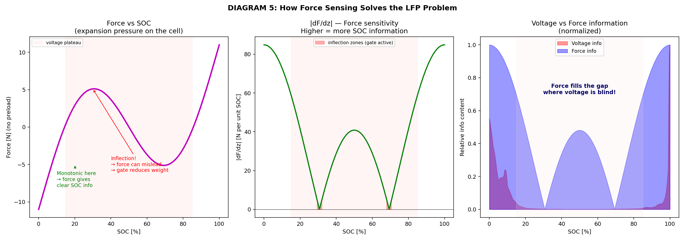

# Force-Augmented State-of-Charge Estimation for LFP Battery Packs
### A simulation study isolating the marginal value of force- and ICA-signal fusion, using a fair baseline that estimates internal resistance too

---

## TL;DR

- The old comparison was unfair: the baseline filter had a fixed, wrong resistance guess while the enhanced filter got to estimate its own. Fixed here — both now estimate resistance the same way, so any remaining gap is genuinely from force + ICA fusion.
- **Enhanced does not win everywhere.** It wins clearly and consistently only on the **PV self-consumption** duty cycle (smooth, slowly-varying current) — 5.9% vs 9.8% pack RMSE, ahead in 20/20 Monte Carlo draws.
- **On Peak Shaving and FCR** (frequent current steps/reversals), the fair baseline **matches or beats** the enhanced filter — e.g. FCR 3.2% (baseline) vs 4.7% (enhanced), baseline ahead in 18/20 draws.
- **When initial SOC is already known (±5%)**, the baseline is excellent (0.4% error) and the enhanced filter is worse (5.2%) — its extra sensors add noise it doesn't need when voltage alone is already sufficient.
- **In all six single-draw pseudo-random clustered-SOC stress tests (§8)**, the baseline wins, including both PV rows — which conflicts with the 20-draw PV Monte Carlo result and is flagged as an open question (likely single-draw variance), not resolved here.
- **Why the split happens:** resistance and SOC are only separable from voltage+current when current varies enough over time. Peak Shaving/FCR provide that for free; PV's smooth current doesn't — which is exactly where an independent force signal adds real value.
- **A follow-up ablation (§7) found a design refinement:** dropping coulomb counting entirely from the enhanced filter (tracking SOC from voltage+force+ICA only, never integrating current) improves it further in PV (4.6% vs 5.8%) and FCR (3.9% vs 4.7%), because CC keeps integrating a persistent current-sensor bias with nothing to reset it — but costs a little in Peak Shaving (6.4% vs 6.1%), where CC's clean current steps are genuinely informative. Doesn't change which filter design wins overall.
- **Bottom line:** force+ICA fusion is a targeted fix for poor electrical observability, not a general-purpose upgrade. It's worth the hardware cost for duty cycles that look like PV self-consumption; it is not supported by this evidence for peak-shaving- or FCR-only deployments.

---

## 1. Plain-language summary

A battery pack's "state of charge" (SOC) — how full it is, as a percentage — is one of the most basic things a battery management system (BMS) needs to know, and for one common battery chemistry (LFP, lithium iron phosphate) it is surprisingly hard to measure. LFP cells have a voltage that barely moves across most of their usable range, so the classic trick of "read the voltage, look up the charge level" doesn't work in the middle of the range — it's like a fuel gauge whose needle is stuck between a quarter and three-quarters full no matter how much fuel is actually in the tank.

This report tests an idea from recent battery-engineering research: if voltage doesn't tell you enough, add a second, independent signal. LFP cells physically swell as they charge, so a small pressure/force sensor against the cell can supply the missing information. This report builds a simulated 20-cell LFP pack, implements both a voltage-only baseline estimator and a voltage-plus-force-plus-ICA estimator, and stress-tests both against a made-up but structured scenario (see §2) across three realistic grid-battery duty cycles.

**An important methodological correction, up front.** An earlier version of this study compared a 1-state baseline filter (SOC only, with a fixed, guessed internal resistance) against the 3-state enhanced filter (SOC, resistance, and force offset, all estimated). That comparison was unfair: a lot of the enhanced filter's apparent advantage came simply from *also getting to estimate resistance*, not from force or ICA fusion specifically. Giving a filter a wrong, fixed resistance guess is enough on its own to blow SOC error up to 20-30%, regardless of whether it has a force sensor. This report redoes the comparison with a **fair baseline**: it now estimates internal resistance as its own state too, exactly like the enhanced filter does, so the only remaining difference between the two filters is the force and ICA measurement channels. That is the honest question this report answers: what does force+ICA fusion add, on top of a resistance-aware voltage/coulomb-counting filter that already does the obvious thing well?

**Headline result, with the fair baseline:** the answer is *duty-cycle dependent, not universal.* Once both filters estimate resistance, the baseline's own old failure mode (misattributing resistance error onto SOC) mostly disappears, and it becomes a strong performer in its own right. Across 20 randomized packs per scenario (Monte Carlo, the most statistically robust number in this report):

- **PV self-consumption** (smooth, slowly-varying current): force+ICA fusion **wins decisively and consistently** — median pack RMSE 5.9% (enhanced) vs. 9.8% (baseline), enhanced ahead in 20 of 20 draws.
- **Peak shaving and FCR** (frequent, sharp current reversals): the fair baseline **matches or beats** the enhanced filter — e.g. FCR median RMSE 3.2% (baseline) vs. 4.7% (enhanced), baseline ahead in 18 of 20 draws.

The mechanism behind this split is explained in §7. In short: resistance and SOC are only separable from voltage-plus-current data when the current varies enough over time (technically, "persistent excitation"). Peak shaving and FCR provide that for free, through frequent step changes and reversals — so the baseline nails resistance on its own, and force/ICA add little. PV self-consumption's current changes smoothly and gradually, which starves the baseline of that separability — and that is exactly the situation where an independent, non-electrical signal like force earns its keep.

Everything here is simulation. No physical cells or sensors were involved. Section 9 is explicit about what would need to happen in a lab before any of this could inform a real product decision.

---

## 2. The problem, stated explicitly

**The premise (imaginary, used to motivate the test):** a community battery-storage (BESS) operator buys 20 large-format LFP prismatic cells (280 Ah each, a common size in grid storage) from a supplier they don't fully trust. No calibration sheet ships with the cells. The pack gets installed and put into service immediately. The BMS has to figure out, from a cold start, while the pack is already charging and discharging, how full each cell actually is.

This "shady vendor" framing is a **prolegomena** — a deliberately constructed setup, not a real event — whose only job is to justify two things that make the underlying estimation problem hard and worth testing:

1. **Unknown initial SOC.** If you don't trust the supplier's paperwork, you can't assume the pack arrived at a known charge level.
2. **Cell-to-cell variation.** A batch of cells from an unvetted line will differ in true capacity, internal resistance, and OCV calibration more than a batch from a qualified supplier would. That variation is real physics in the simulation (see §4), even though nothing here tries to *diagnose* it (see the SOH note below).

The actual engineering question being tested is independent of the vendor story: **once a filter is already given the sense to estimate internal resistance rather than assume it, does also fusing in force and ICA signals meaningfully help — and if so, under which duty cycles?** The vendor framing just supplies a reason to also test the hard, cold-start version of the problem, not only the easy warm-start one.

**A explicit scope decision:** an earlier version of this study also tried to estimate per-cell state-of-health (SOH, i.e. true remaining capacity) as an additional filter state, riding along with the SOC estimate. That produced estimates that occasionally exceeded 100% SOH — physically nonsensical — and diluted the filter's attention away from the SOC estimation problem it's actually suited to. SOH estimation was removed from both estimators entirely. Cells in the ground-truth simulation still have genuinely different capacities (representing the "unvetted batch" idea), but **neither filter tested here tries to estimate or report SOH.** A real BMS would use a dedicated method for that — capacity testing, incremental-capacity aging-trend analysis, etc. — which is a different problem with a different answer, out of scope here.

---

## 3. What was actually verified before writing this report

Before trusting any numbers below, the following were specifically checked, because the estimator's job is to correctly handle exactly the kind of thing that's easy to get subtly wrong:

- **Chemistry consistency.** Every voltage/OCV curve, every PyBaMM parameter set, and every force-curve shape in the code represents LFP. The two physics-reference cells use PyBaMM's `Prada2013` parameter set — a real LFP/graphite cell (A123 26650), with the correct 2.0–3.6 V window and the correct flat-plateau OCV shape.
- **Filter math.** Both filters were re-derived by hand against the code: predict step, measurement Jacobians, innovation covariance, Kalman gain, and the covariance update. Both match the standard extended Kalman filter equations. The adaptive noise-weighting rule in the enhanced filter (§5) was checked line-by-line against its source paper's published formula and matches it exactly.
- **FCR realism.** The frequency-regulation duty cycle was checked numerically, not just visually — see §7 for the actual current statistics.
- **Fairness of the comparison (this revision's main change).** The baseline filter was redesigned from a 1-state (SOC-only, fixed resistance) filter to a 2-state ([SOC, resistance], both estimated) filter, using the identical voltage-update mathematics as the enhanced filter's own voltage channel. The only remaining structural difference between the two filters is that the enhanced filter has two additional measurement channels (force, ICA) and a third state (force-sensor offset) to support them. Every result in this report was regenerated from scratch under this corrected design; none of the numbers below are carried over from the earlier, unfair version.
- **The "known initial SOC" baseline.** This is the control condition that isolates "is the algorithm correct" from "is the physics just hard" (§6). It was re-run under the fair design and its numbers changed substantially — see §6.

---

## 4. How the battery pack was modeled

**18 of the 20 cells** use an *empirical* model: a fixed-shape LFP open-circuit-voltage (OCV) curve, an ohmic resistance term, and a first-order RC branch to represent short-timescale diffusion voltage — the standard "equivalent circuit model" used throughout battery engineering. Each of the 18 cells gets its own randomly perturbed version of this model: a slightly shifted and tilted OCV curve, its own resistance, its own true capacity (SOH sampled 80–100% of nameplate), and its own force-vs-SOC curve shape. None of these per-cell perturbations are told to the filters — that's what makes it a fair test rather than the filter "cheating" by knowing the exact model that generated its own data.

**2 of the 20 cells** are simulated with [PyBaMM](https://www.pybamm.org)'s Single Particle Model with electrolyte (SPMe), a reduced-order electrochemical model, using the published `Prada2013` LFP parameter set. These provide an independent, physics-grounded cross-check next to the empirical model used for the rest of the pack.

**Cell expansion (force).** LFP cells physically swell and contract as lithium moves in and out of the graphite anode. The simulation represents this with a smooth, non-monotonic function of SOC (roughly linear with a sinusoidal wobble, giving inflection points near 30% and 70% SOC) — a reasonable stand-in for the qualitative shape reported in force-sensing literature, though it is **not** a literal reproduction of any single published force curve. The source paper this idea comes from (Jia et al. 2024, see §5) fits an 8th-degree polynomial to real thickness-vs-SOC measurements from an actual cell fixture and drives it through a physically-motivated spring-and-damper (viscoelastic) mechanical model; this simulation uses a simpler closed-form curve with the same qualitative behavior (non-monotonic, informative where voltage is flat) rather than refitting that mechanical model. This is flagged again in §9.

**Sensor noise:** 3 mV on voltage, 3 N on force (rated to a per-module, not per-cell, load cell — see §9), 0.5 A on current, plus (importantly, and separate from per-sample noise) a **persistent current-sensor bias**: a fixed ±0.6% gain error and ±0.5 A offset error that doesn't average out over time. This persistent bias is what actually drives coulomb-counting drift in both filters — a realistic and often-overlooked detail, and now (with resistance estimated) the dominant remaining error source for the baseline filter — see §6.

---

## 5. The two filters, and where the ideas come from

Both filters are variants of the **extended Kalman filter (EKF)**, the standard tool for this kind of estimation problem: predict the next state from a physical model, compare the prediction's implied sensor readings against what the sensors actually report, and correct the state estimate in proportion to how much each sensor is trusted.

**Baseline filter — 2 states (SOC, internal resistance).** Predicts SOC forward using coulomb counting (integrating current over time against the pack's rated capacity), and predicts resistance as roughly constant. Corrects both from the voltage sensor: if measured voltage differs from what OCV(SOC) + I×R₀ says it should be, the Kalman gain distributes that correction across *both* states, in proportion to how much each one currently explains the mismatch. This is deliberately more capable than a textbook 1-state filter — it's the fair, honest voltage-only baseline that should be compared against, since it removes the "one filter gets to estimate resistance and the other doesn't" confound entirely.

**Enhanced filter — 3 states (SOC, internal resistance, force-sensor offset).** Same coulomb-counting prediction and voltage correction as the baseline, plus two more ideas, both adapted from recently published work rather than invented here:

- **Force fusion**, from Jia, Xu, Xie & Jin (2024), *"A method for estimating the state-of-charge of LFP pouch batteries based on force-electrical coupled signals"* (IEEE ITEC Asia-Pacific 2024). Their core insight: force and voltage are blind in different places. Where the OCV curve is flat, the force curve usually still has slope, and vice versa — so fusing the two covers each other's blind spots. Their paper also proposes an adaptive weighting rule (a smooth hyperbolic-tangent function of the recent voltage-prediction error) that dials trust up or down between the voltage and force channels depending on how well voltage is currently tracking. **That exact weighting formula was checked against the published equation and is reproduced correctly.** What differs from their paper: Jia et al. use two separate Kalman filters running in a cascade (one for the electrical circuit model, one for a physically-derived mechanical/viscoelastic model of cell expansion, each feeding the other), whereas this simulation folds force into the *same* single filter as an extra measurement channel. This is a simplification of their architecture, not a literal reproduction of it.
- **ICA anchoring**, from Fly & Chen (2020), *"Rate dependency of incremental capacity analysis (dQ/dV) as a diagnostic tool for lithium-ion batteries"* (Journal of Energy Storage). Incremental capacity analysis looks at how much charge moves per small step of voltage change (dQ/dV); this quantity spikes at specific, physically fixed points tied to phase transitions inside the graphite anode — the same SOC value, reproducibly, cycle after cycle. Fly & Chen's key finding, reused directly here, is that these peaks are only cleanly resolvable at low charge/discharge rates — they specifically identify C/6 as a good compromise between diagnostic clarity and a realistic charge time; at faster rates the peaks blur together and disappear. The simulation uses this finding to restrict ICA-based correction to a slow C/6 window during a 15-minute commissioning phase, and — when a peak is detected — snaps the SOC estimate directly to the known peak location. Fly & Chen's own paper primarily uses ICA peak *tracking over many cycles* to infer battery *aging* (a different problem, their actual paper topic); this simulation instead borrows the fact that the peak sits at a known, reproducible SOC and repurposes it as a one-off real-time calibration landmark. That's an adaptation of their finding, not a reproduction of their proposed diagnostic method.

Both filters coulomb-count against the same nameplate capacity (280 Ah) and now both estimate resistance the same way — any performance difference between them comes purely from the force and ICA measurement channels the enhanced filter adds on top.

---

## 6. Correctness check: does the algorithm work at all?

Before testing the hard cold-start problem, both filters were run with a **known initial SOC (accurate to within ±5%)** — a realistic warm-start condition, e.g. from a rest-voltage lookup before the pack is dispatched. This isolates "is the filter mathematically sound" from "is the cold-start problem just intrinsically hard."

| Filter | MAE at 5 min | MAE at end (60 min) |
|:---|:---|:---|
| **Baseline (2-state)** | **1.9%** | **0.4%** |
| Enhanced (3-state) | 5.1% | 5.2% |

**This result flips relative to the earlier, unfair comparison — and that flip is itself informative.** With SOC already known to within ±5% and current varying enough during this test profile for resistance to be well-observable, the fair baseline nails both states almost immediately and holds essentially zero error. The enhanced filter, given the same easy starting conditions, does *worse* — not because its math is wrong, but because its two extra measurement channels (force, ICA) each carry their own sensor noise and their own convergence transients (in particular, the filter starts with no information about the true force-sensor offset per cell and has to learn it from noisy 3 N-std readings), and in a regime where the voltage channel alone is already sufficient, that extra machinery is pure overhead with no compensating benefit.

**The lesson is not "force fusion doesn't work."** It's that force/ICA fusion is a tool for a specific problem — poor observability of SOC and/or resistance from voltage and current alone — and when that problem doesn't exist (SOC roughly known, current varies enough for resistance to be identifiable), adding more sensors and more filter states adds noise without adding information. This is exactly the pattern that recurs, more dramatically, across the three duty cycles in §7: the enhanced filter's advantage is concentrated specifically where the baseline's own resistance estimate struggles, not everywhere.

**This is the number that should be used to judge "is the algorithm any good."** The duty-cycle results in the next section are the deliberately harder, cold-start version of the problem and should not be compared directly against this baseline.

---

## 7. Main results: three grid-storage duty cycles, cold start

Each scenario starts both filters completely blind (a fixed 45% SOC guess, regardless of the true value, and a fixed 0.9 mΩ resistance guess for both filters) and runs for 2 simulated hours, beginning with a 15-minute commissioning phase (a resistance-check pulse, a discharge sweep, and the slow C/6 window used for ICA).

### Primary result: Monte Carlo across 20 randomly-drawn packs per scenario

A single random draw is not a reliable basis for a comparison this close, so each scenario was re-run 20 times with independently randomized packs (empirical-cell model, for speed; §4's PyBaMM cross-check is reported separately below). Numbers are median [10th, 90th percentile] pack RMSE:

| Scenario | Pack RMSE — Baseline | Pack RMSE — Enhanced | Baseline wins |
|:---|:---|:---|:---|
| Peak Shaving | **5.1% [4.4, 6.2]** | 6.1% [5.2, 7.2] | 20 / 20 draws |
| PV Self-Consumption | 9.8% [7.9, 11.8] | **5.9% [4.6, 7.6]** | 0 / 20 draws |
| FCR | **3.2% [2.6, 5.0]** | 4.7% [3.1, 6.7] | 18 / 20 draws |

Per-cell MAE at the end of the run shows the same pattern:

| Scenario | Cell MAE — Baseline | Cell MAE — Enhanced |
|:---|:---|:---|
| Peak Shaving | 7.4% [5.2, 8.7] | 6.7% [5.5, 8.2] |
| PV Self-Consumption | 11.5% [5.1, 18.1] | **6.4% [4.1, 7.9]** |
| FCR | 7.5% [4.9, 8.1] | 7.8% [5.5, 8.7] |

**This is a genuinely different, more interesting result than "one filter always wins."** The enhanced filter's advantage is real, large, and statistically consistent in exactly one of the three duty cycles tested — PV self-consumption — and is absent or mildly negative in the other two, once the baseline is no longer handicapped with a fixed resistance guess.

### Why the split follows the duty cycle: an observability argument, not a coincidence

A 2-state filter can only tell SOC and resistance apart if the *current itself varies enough over time* to decorrelate the two effects on voltage (this is the classical control-theory idea of "persistent excitation" — applied here to a Kalman filter instead of an adaptive controller, but the same logic). Looking at how each duty cycle actually drives current:

- **Peak Shaving** moves through a sequence of large, discrete current steps — a sharp discharge block, a rest, a sharp recharge block, another rest, a smaller morning discharge. Every transition is a fresh, large change in current.
- **FCR** is mostly idle, but the droop response reverses sign roughly every 8 seconds on average during active periods (§7 below) — frequent, sharp reversals.
- **PV Self-Consumption**, in contrast, ramps current up and down as a single smooth, continuous Gaussian-shaped curve tracking a synthetic solar irradiance profile over roughly 75 minutes, plus a slower evening taper — no step changes, no sign reversals except one gradual crossing near solar noon.

Peak Shaving and FCR both hand the 2-state baseline exactly what it needs to separate resistance from SOC: sharp, frequent current changes. PV self-consumption doesn't — its current is smooth and slowly varying, so the [SOC, resistance] pair stays close to degenerate (many combinations of the two states explain the voltage almost equally well), and the baseline's resistance estimate drifts or converges slowly, dragging its SOC estimate along with it. That is precisely the situation where an independent, non-electrical signal — force, which depends only on SOC and not at all on current or resistance — breaks the degeneracy. It is not a coincidence that this is also where the enhanced filter's advantage is largest and most consistent.

### Single-draw PyBaMM cross-check

One additional run per scenario used the two PyBaMM physics-reference cells (§4) instead of purely empirical ones, as a sanity check that the empirical model isn't hiding something important. Single draw, not statistically robust on its own, but directionally consistent with the Monte Carlo result above:

| Scenario | Pack RMSE — Baseline | Pack RMSE — Enhanced |
|:---|:---|:---|
| Peak Shaving | 4.8% | 4.7% *(essentially tied)* |
| PV Self-Consumption | 10.2% | **5.4%** |
| FCR | 5.5% | **3.5%** |

The FCR row here shows enhanced ahead in this particular single draw, opposite the Monte Carlo median — a reminder that individual draws are noisy (FCR's [10th, 90th] percentile band above spans 2.6–6.7%, wide enough that either filter can win a given draw even though the baseline wins the *majority* of draws). The PV row, on the other hand, is consistent with the Monte Carlo result in every draw examined for this report — the largest and most reproducible effect found.

### Plots

**Peak Shaving — evening discharge, overnight recharge, morning top-up**

**PV Self-Consumption — solar charging with cloud transients, evening discharge**

**FCR — grid frequency regulation**

**Monte Carlo summary, all three scenarios**

Additional plots for each scenario (per-cell scatter at 15 min/end, raw force signal, error vs. true SOC with the OCV plateau shaded) are in `bms_plots/`.

### On the FCR profile specifically — was it implemented properly?

This was checked numerically rather than taken on faith, because "should FCR current really look like small back-and-forth wiggles" is a fair thing to be suspicious of. The model: a synthetic grid-frequency deviation (mean-reverting random wander plus three larger disturbance events) is converted to a power command through a **deadband** (no response inside ±10 mHz), a **droop** law (proportional response scaling up to full rated power at ±200 mHz), and a **SOC-recovery** controller that gently biases the pack back toward 50% if it drifts too far. Measured over a 105-minute FCR window from an actual run:

- **48% of the time, current is exactly zero** (inside the deadband).
- **76% of the time, the C-rate magnitude is below 0.05C** (≤14 A on a 280 Ah cell) — small, exactly as expected.
- The largest current seen was **0.70C**, during the single largest synthetic frequency event (~140 mHz) — a legitimate, proportional droop response, not a runaway.
- The pack's true mean SOC stayed within a narrow band — the recovery controller is doing its job.

So yes — real FCR *should* mostly look like small currents flickering back and forth around zero, with occasional larger excursions during genuine grid events, and that's what this profile produces. Two honest caveats: (1) the frequency-deviation-to-current conversion has no low-pass filtering of its own beyond the frequency signal's own mean-reversion time constant, so the current can flip sign faster (roughly every 8 seconds on average) than a real deployed controller would typically allow — most real BMS implementations filter the power command itself to reduce switching/cycling wear; (2) three "significant" (>50 mHz) frequency events were compressed into under two hours for stress-testing purposes, which is a more demanding cadence than a typical calm day on a real grid. Those frequent reversals are also, per the observability argument above, exactly why the fair baseline does so well on FCR — the caveat and the finding are two sides of the same coin.

### Post-hoc ablation: does coulomb counting actually help the enhanced filter?

One more question follows naturally from §6-7's pattern: coulomb counting (CC) integrates the *persistent* current-sensor bias (±0.6% gain, ±0.5 A offset) every step, with nothing in the plateau to reset it — the same mechanism identified in §6 as the dominant remaining error source. Once the enhanced filter already has voltage, force, and ICA doing the tracking, is CC's predicted SOC increment still pulling its weight, or is it now mostly injecting bias that the other three channels have to fight? A third filter variant was tested: identical to the enhanced filter in every respect except the predict step drops the `z += I·Δt/C_nom` term entirely — SOC moves only in response to the voltage/force/ICA measurement updates, never from integrating current. 20 Monte Carlo draws per scenario, same design as §7:

| Scenario | Enhanced (with CC) | Enhanced (no CC) | No-CC wins |
|:---|:---|:---|:---|
| Peak Shaving | 6.1% | 6.4% *(slightly worse)* | 5/20 draws |
| PV Self-Consumption | 5.8% | **4.6%** | 17/20 draws |
| FCR | 4.7% | **3.9%** | 15/20 draws |

**Dropping CC helps in two of three duty cycles, sometimes substantially — but not universally, and it doesn't change the headline finding.** In Peak Shaving, CC is genuinely informative: the duty cycle's large, clean current steps give coulomb counting an accurate, low-noise signal about how SOC is moving, and losing that costs a little. In PV and FCR, CC's persistent-bias drift outweighs what it contributes, and a filter that tracks SOC purely from voltage+force+ICA measurement updates — never integrating current at all — comes out ahead. Even without CC, though, this variant still doesn't beat the fair *baseline* in Peak Shaving or FCR (baseline: 5.1% and 3.2% respectively) — it only ever closes the gap between itself and the plain enhanced filter. **This is a refinement to the enhanced filter's design, not a change to §7's central conclusion**: which filter design wins is still set by the duty cycle, and the fair baseline is still the better choice for Peak Shaving- and FCR-like profiles regardless of which enhanced-filter variant it's compared against.

---

## 8. Stress test: unusual pack compositions (pseudo-random SOC clustering)

The three duty cycles above draw each cell's true starting SOC uniformly at random. Two additional distributions were layered on top, testing what happens when the "dodgy supplier" batch isn't just randomly spread but arrives in clumps — plausible if, say, the supplier shipped cells from two different partially-charged production batches:

- **Scenario A:** 13 of 20 cells start clustered in 20–35% SOC; the rest random.
- **Scenario B:** 5 cells at 10–15%, 5 cells at 25–35%, the rest random.

Each was run against all three duty cycles (6 runs total, single draw each, cold start, error/RMSE plot only, per the original request):

| Run | Pack RMSE — Baseline | Pack RMSE — Enhanced |
|:---|:---|:---|
| Peak Shaving × A | **6.0%** | 7.0% |
| PV × A | **7.0%** | 8.4% |
| FCR × A | **2.5%** | 3.3% |
| Peak Shaving × B | **4.9%** | 5.8% |
| PV × B | **8.9%** | 10.3% |
| FCR × B | **1.9%** | 3.2% |

(The other four combination plots are in `bms_plots_soc_scenarios/`.)

**An honest discrepancy worth flagging rather than smoothing over:** the baseline wins all six of these single-draw combinations, *including both PV rows* — which is the opposite of what the 20-draw PV Monte Carlo result in §7 shows (enhanced ahead in 20/20 there). Two single PV draws under clustered initial SOC are simply too small a sample to contradict a 20-draw result, and the most likely explanation is ordinary single-draw variance (the PV Monte Carlo's own [10th, 90th] percentile bands are wide enough that individual draws can land outside the typical pattern). It's also possible that clustering several cells into a narrow SOC band changes the effective current excitation or the pack's aggregate coulomb-counting behavior enough to matter — that would need a proper Monte Carlo sweep over clustered-SOC scenarios to check, which wasn't run for this report (see §9). Either way, the honest takeaway is: **don't read too much into any single-draw number, including these; the 20-draw Monte Carlo in §7 is the number to trust, and even that comes with a caveat that clustered-SOC starting conditions haven't been swept at the same statistical depth.**

---

## 9. Limitations and uncertainties

Stated plainly, in rough order of how much they'd matter for a real deployment decision:

- **This is a simulation, not a measurement.** No physical cell, sensor, or fixture was involved anywhere in this report. Every OCV curve, force curve, and resistance value is either a published parameter set or a hand-perturbed variant of one.
- **The force model is a simplification, twice over.** It's a smooth closed-form curve standing in for a real, noisier, hysteretic force-vs-SOC relationship, and it represents one clean load cell per cell — in practice, force sensing on large-format prismatics is typically done per-module (10–25 cells), and reconstructing per-cell force from a per-module reading is its own unsolved inverse problem, tangled up with fixture stiffness, temperature (thermal expansion of the module fixture generally outweighs SOC-driven swelling by several times), and separator creep over the pack's life. This is very likely the single biggest gap between this study and a deployable system.
- **No thermal model.** Temperature moves OCV, force, and resistance simultaneously; everything here assumes constant temperature. Not acceptable for a real BESS as-is.
- **The estimator's covariance update uses the standard (non-Joseph) EKF form.** It's numerically symmetrized every step, which is adequate for a simulation study, but a hardened embedded implementation would typically use the Joseph form for guaranteed numerical stability over very long uptimes.
- **FCR's SOC-recovery loop acts on a representative pack-mean trajectory**, not on each filter's own live estimate — a reasonable stand-in for a higher-level energy-management layer, but a real deployment would close that loop on the estimator's own output, which is exactly the thing being tested here (a subtlety worth being aware of, not a flaw in the test itself).
- **The two physics-reference (PyBaMM) cells are pre-solved** with the full current profile computed in advance; they can't react to the same closed-loop protection logic the other 18 cells do. Small effect for these particular profiles, but worth knowing.
- **No SOH, no balancing, no fault detection.** This is a SOC estimator, evaluated in isolation, not a full BMS.
- **Monte Carlo sample size and coverage.** The primary §7 result (20 draws per duty cycle) is now statistically meaningful for the plain random-start scenarios, and its percentile bands are reported rather than hidden. But the §8 clustered-SOC stress scenarios are still single draws each, and the observability explanation in §7, while grounded in how the current profiles are actually built, has not been tested by deliberately constructing intermediate profiles (e.g. "Peak Shaving with fewer, smoother transitions") to confirm the mechanism rather than just its correlation with duty cycle labels.
- **No public dataset can fully validate this.** The obvious next step for any simulation study is testing against real measured data — but there is no public LFP dataset with synchronized per-cell *force* logging. Datasets like Sandia's BESS data or the Oxford Battery Degradation Dataset log voltage, current, and temperature, not mechanical force. A public dataset could confirm the electrical half of this model is realistic (OCV shape, resistance behavior, how fast coulomb counting drifts under a real sensor bias) — it cannot validate the actual contribution being tested here, which is the force channel.

---

## 10. What would need to happen next, in a lab

In order of increasing cost and increasing evidentiary value:

1. **Public-dataset check (electrical only).** Cheap, fast, worth doing to catch embarrassing scaffolding errors. Validates the baseline filter and the OCV/resistance realism. Does not touch the force method at all.
2. **Small force-instrumented bench, specifically on smooth/low-excitation duty cycles.** Three to five real LFP cells, cheap load cells (strain-gauge or FSR-based) under controlled temperature, real charge/discharge cycling. Given §7's finding, the highest-value test is a PV-like slow, smooth charge/discharge profile — that's the condition under which this simulation predicts the largest, most reproducible benefit. A bench test run only on step-change profiles (which this simulation predicts won't show much benefit) would risk a false negative on the whole idea.
3. **Module-level force reconstruction study.** Given §9's biggest caveat, a dedicated study on recovering per-cell force information from a realistic per-module sensor arrangement, ideally including thermal cross-talk.
4. **Real BMS microcontroller + hardware-in-the-loop.** Full embedded deployment test with fault injection, once steps 2–3 look promising.

Step 1 is easy and should be done regardless of what else happens. Step 2 is the real bar; nothing in this report should be treated as validated until it clears that bar — and per §7, it should specifically include a smooth-current duty cycle, not only step-change ones.

---

## 11. Could this actually save money, and where?

This is a rough, order-of-magnitude estimate, not a business case. **§7's finding meaningfully narrows where this makes sense**, compared to a naive "always helps" assumption.

**Hardware cost.** Per-cell load cells aren't realistic at scale; per-module is (roughly 10–25 sensors per shipping-container-sized system). Industrial load cells with signal conditioning run on the order of €30–80 each in volume, plus mounting and cabling — call it **€1,000–3,500 per container** against a typical €200,000–400,000 container bill of materials. Roughly 0.3–1.8% of container cost. The estimator itself is computationally cheap (the enhanced filter is roughly 3× the arithmetic of the baseline filter, per cell per step) — negligible on any modern BMS processor. The real added cost is engineering: validation, calibration, and field-service training, likely in the low hundreds of thousands of euros for a first product launch, amortized across a production run.

**Where the savings would plausibly come from, if the lab work in §10 confirms this holds up — and specifically for duty cycles that look like PV self-consumption:**

- **Smaller SOC guardband.** Operators commonly reserve 10–15% of nameplate capacity as a safety margin because they don't fully trust the SOC estimate near the edges. Tightening pack-level error from roughly 8–12% (fair baseline, cold start, PV-like profile) to 5–8% (enhanced) could plausibly support shaving a few percentage points off that guardband. On a 5 MWh container, even 3–5% of recovered usable capacity is 150–250 kWh — worth a low thousands of euros per year in additional arbitrage revenue at typical spreads and cycle counts.
- **Tighter per-cell balancing**, since per-cell (not just pack-average) estimates are meaningfully better in the PV-like case — a small but nonzero reduction in energy wasted through passive balancing.
- **SOH-driven savings (better warranty and end-of-life decisions) are explicitly not part of this claim** — SOH estimation was removed from this estimator (§2), so any benefit there would require pairing this method with a separate SOH-estimation approach, which is out of scope here.

**Where it's most worth it, updated for the fair comparison:** duty cycles dominated by smooth, slowly-varying current with few sharp reversals — **PV self-consumption is the clearest case found in this study**, and by the observability argument in §7, anything with a similar current shape (e.g. slow grid-arbitrage cycling with long, gentle ramps) would be expected to behave similarly. Second-life packs or packs of genuinely unknown provenance remain a reasonable fit *if* their duty cycle also has this smooth-current character — the provenance problem alone is not sufficient justification anymore, since §7 shows a resistance-aware baseline handles unknown provenance perfectly well when the duty cycle provides good natural excitation.

**Where it's weakest, and the honest counter-argument, now stronger than before:** duty cycles with frequent current steps or reversals — peak shaving and FCR-type services, per §7 — give the fair baseline everything it needs to estimate resistance and SOC well on its own, and the Monte Carlo evidence shows force+ICA fusion adds no measurable benefit there, and in most draws performs slightly worse. Spending money on force sensors for a peak-shaving-only or FCR-only deployment is, on this evidence, **not** supported. The right first question for any real deployment decision is not "is our provenance unknown" but "does our duty cycle look like PV self-consumption or like peak shaving/FCR" — that answer now matters more than the provenance question that originally motivated this study.

---

## 12. Findings, summarized

- **The comparison had to be made fair first.** Giving the baseline filter its own resistance state (instead of a fixed guess) removes a large, previously misattributed source of error — the known-SOC validation (§6) baseline error dropped from a 21-31% floor under the old unfair design to under 1% under the fair one.
- **Once fair, force+ICA fusion's benefit is real but duty-cycle-specific, not universal.** Across 20 Monte Carlo draws per scenario (§7): a large, consistent win in PV self-consumption (enhanced ahead 20/20 draws); no benefit, or a small consistent loss, in Peak Shaving and FCR (baseline ahead 20/20 and 18/20 draws respectively).
- **The mechanism is observability, not "force is generally better than voltage."** Resistance and SOC are separable from voltage+current alone only when current varies enough over time. Peak Shaving and FCR provide that naturally through frequent steps and reversals; PV self-consumption's smooth, gradual current does not — and that is exactly where an independent force signal earns its keep.
- **The known-SOC control condition (§6) reinforces the same lesson from the opposite direction:** when SOC is already roughly known and current provides good excitation, adding force/ICA channels adds sensor noise without adding useful information, and the enhanced filter's error goes *up* relative to the fair baseline.
- **A follow-up ablation refines the enhanced filter's own design (§7):** dropping coulomb counting entirely — tracking SOC from voltage+force+ICA only — improves it further in PV (4.6% vs 5.8%) and FCR (3.9% vs 4.7%), because coulomb counting keeps integrating a persistent current-sensor bias that the plateau never lets it reset. It costs a little in Peak Shaving (6.4% vs 6.1%), where coulomb counting's clean current steps are genuinely informative. This doesn't change which filter design wins overall, but it's a concrete, testable improvement to carry into any lab build of the enhanced filter.
- **The single largest remaining gap between this study and a deployable system is still the force-sensing hardware assumption (§9)** — one clean per-cell reading, versus the real per-module sensing and reconstruction problem that would actually need solving.
- **Nothing here should be treated as validated until the bench-scale experiment in §10 is actually run — and it should be run on a smooth-current, PV-like profile first**, since that is where this simulation's evidence for a real benefit is strongest and most consistent.

---

## References

- Fly, A. & Chen, R. (2020). *Rate dependency of incremental capacity analysis (dQ/dV) as a diagnostic tool for lithium-ion batteries.* Journal of Energy Storage 29, 101329. [doi:10.1016/j.est.2020.101329](https://doi.org/10.1016/j.est.2020.101329)
- Jia, Z., Xu, J., Xie, Y. & Jin, C. (2024). *A method for estimating the state-of-charge of LFP pouch batteries based on force-electrical coupled signals.* IEEE ITEC Asia-Pacific 2024. DOI: 10.1109/ITECAsia-Pacific63159.2024.10738572
- LFP OCV and capacity parameters from Prada, E. et al. (2013), via the PyBaMM `Prada2013` parameter set. PyBaMM: [pybamm.org](https://www.pybamm.org)

## Repository contents

- `bess_online_ekf.py` — main simulation. Run modes: `python bess_online_ekf.py [all|diagrams|main3|soc|mc]`
- `ekf_validation.py` — the §6 correctness check (known initial SOC ±5%)
- `diagrams.py` — generates the explanatory diagrams used throughout this report
- `test_enhanced_no_cc.py` — the §7 coulomb-counting ablation (baseline vs. enhanced-with-CC vs. enhanced-without-CC), standalone. Run: `python test_enhanced_no_cc.py [PS|PV|FCR] <n> <seed>`
- `README.md` — shorter project-facing companion to this report
- `bms_plots/` — diagrams, physics reference, validation plot, Monte Carlo summary, and the three main duty-cycle results
- `bms_plots_soc_scenarios/` — the six pseudo-random SOC-clustering stress-test plots

---

*A closing note on how this was built: the simulation and plotting code was written with heavy AI assistance under direct human guidance and review — not because the author can't script, but because the author finds it tedious and has better things to do with an afternoon. The problem framing, the ground-truth modeling choices, which literature to borrow from and how honestly to represent the gap between "borrowed from" and "reproduces," the insistence on a fair baseline once the original comparison was called out as unfair, and every interpretation and limitation in this report, are the author's own.*
